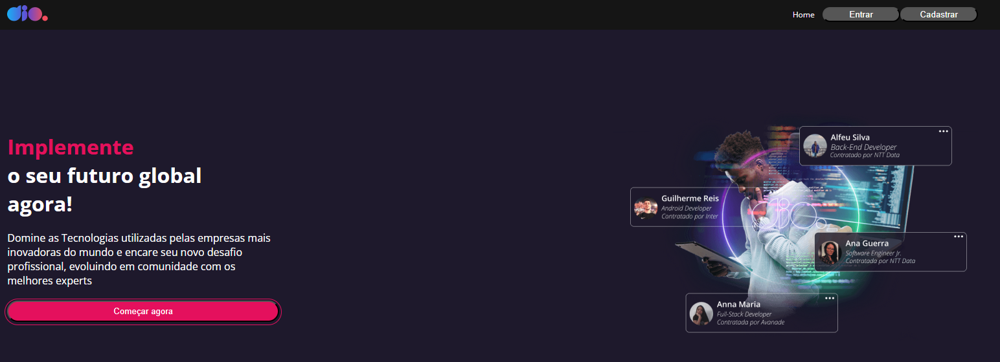
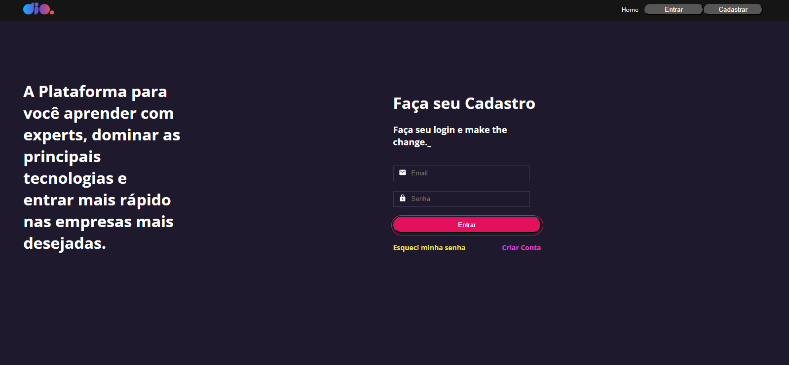
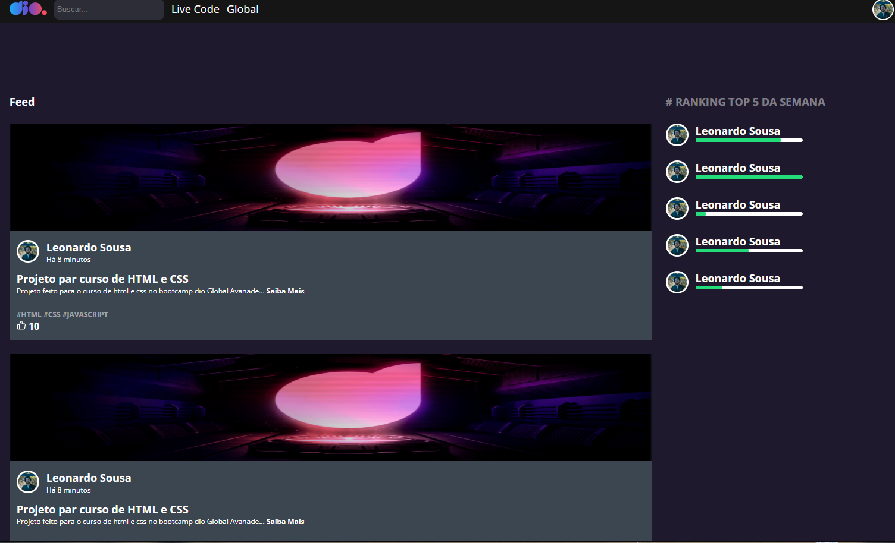

# site-dio-clone

Clone da página inicial da **[Digital Innovation One
(DIO)](https://www.dio.me/)**, desenvolvido para fixar os conteúdos
aprendidos no curso de **React**.\
O objetivo do projeto é praticar conceitos como:\
- Uso do **React Router DOM** para navegação entre páginas\
- Construção de aplicações web **responsivas**\
- Estilização com **Styled-Components**\
- **Reutilização de componentes** para uma melhor organização do código

------------------------------------------------------------------------

## 🚀 Tecnologias Utilizadas  

  
  
  
  
  
  


------------------------------------------------------------------------

## 📦 Como rodar o projeto

### ✅ Pré-requisitos

-   [Node.js](https://nodejs.org/) (versão 14+ recomendada)\
-   npm ou yarn instalado

### ▶️ Passos

``` bash
# Clone este repositório
git clone https://github.com/seu-usuario/site-dio-clone.git

# Acesse a pasta do projeto
cd site-dio-clone

# Instale as dependências
npm install
# ou
yarn install

# Execute o projeto em modo de desenvolvimento
npm start
# ou
yarn start
```

Após rodar, o projeto estará disponível em: **http://localhost:3000**

------------------------------------------------------------------------

## 📂 Estrutura do projeto

-   **Home** → página inicial (clone da landing page da DIO)\
-   **Login** → tela de autenticação (sem backend, apenas front-end)\
-   **User** → tela de usuário logado (apenas simulação, sem integração
    com API)

------------------------------------------------------------------------

## 🎨 Screenshots

### Home

\
\
\


------------------------------------------------------------------------

## 🌐 Deploy

O projeto está disponível em:\
👉 [site-dio-clone.vercel.app](https://site-dio-clone.vercel.app)

------------------------------------------------------------------------

## 📄 Licença

Este projeto está sob a licença **MIT**.\
Sinta-se à vontade para usar e modificar!

------------------------------------------------------------------------

👨‍💻 Desenvolvido por **Leonardo Felipe de Sousa**
